# Ghidra: Nation State Level Reverse Engineering Tools

Ghidra is the new tool released by the United States National Security Agency for reverse engineering software. It has been under active development for years. There is a lot to love about it. From my initial exploration the string deobfuscation, including inline context, is phenomenal.

# Notes on Other Tools

## IDA Pro

I cut my teeth reverse engineering malware with IDA Pro. IDA is a fantastic piece of software that has many sharp pieces that can break off and choke small children. I've used IDA since it was first released. I  own multiple IDA Pro related t-shirts.

Having spent about 5 years in management, woefully divorced from any ability to do reverse engineering, a lot changed in the field. About six months ago I got an IDA license and I found some huge deal killers for me:

1. IDA is way more expensive. Realistically having ~$10k~ $13k worth of reverse engineering software is a hard sell for information security organizations.
2. License management: In my opinion this is where IDA jumped the shark. It is now a complete pain in the ass to get IDA up and running, involving FlexLM and other crimes against humanity.
3. The GUI is dated, and doesn't play well with high DPI monitors. I have nothing but respect for Ilfak and his crew, they have done awesome work. I have also regrettably aged, and my corneas hardening means I need glasses, bigger fonts, etc. etc.
4. The plugin architecture is just awful. I know and love IDA Python, including all of it's nuances. It's time to move forward.

Regrettably, the above limitations have prevented me from continuing my usage of IDA. What used to be a quick approval process with management for a license purchase has turned into a complex justification ordeal, writing exceptions to policy, and various other bureaucratic nonsense that comes from trying to spend that much money.

## Binary Ninja
Before March 5, 2019 this was my primary reverse engineering tool that I had transitioned to. In addition to sane licensing costs, there is minimal license management, the GUI is based on Qt with full support for high-DPI monitors, and when I change the fonts it doesn't look bad. The dark mode makes reduces eye strain. The Python API is great, albeit limited as it uses Python2.

1. Binja is $500 per year.
2. License management is based on keys, not FlexLM
3. The GUI is great
4. The plugin architecture is mostly ok

I do like the low and medium level intermediate languages (IL) as a reasonable substitute for the Hex-Rays decompiler. It gets the job done. Given Binary Ninja's provenance there are reasons to pay attention to this tool in the future.

## Radare

I have not evaluated Radare, so I will refrain from commenting on it. The price is right on this tool.

## Hopper

Despite it's approachable cost, I have struggled to find a good workflow to use this tool. It's only $40 on the Apple appstore, so there's positives to be found.

# Getting Started with Ghidra

Luckily our favorite spy agency has posted an initial compiled version of Ghidra. Full source code is likely to be coming shortly. This document will deal with version 9.0, and some of the the initial setup steps.

## Installation

Saunter over to http://ghidre-sre.org and download the latest copy.

### Linux setup steps

I use PopOS, an Ubuntu variant by System76. PopOS has replaced my Mac as my preferred OS. Check it out.

```bash
$ sudo apt install openjdk-11-jre openjdk-11-jre-headless openjdk-11-jdk openjdk-11-jdk-headless
```
That gets you the code you the Java libraries needed to run the analysis

Next, unpack Ghidra into a location you'll remember

```bash
$ 7z x ghidra_9.0_PUBLIC_20190228.zip
$ cd ghidra_9.0
$ ./ghidraRun
```

After running you'll see some very Java looking user interface design. Don't judge by this initial Windows 95 UI style, it's much better than it used to be.

### Windows / Mac

RTFM. The documentation is quite good, and will likely involve installing the OpenJDK 11 or higher. Suffer in your bourgeois operating system.

# Using Ghidra

There are a lot of features in Ghidra that can be a bit overwhelming to begin with. I'll discuss some of the initial GUI configuration that I've found for better usability.

## A Tour of the User Interface

When you first start Ghidra, you'll see the initial project view. All of your projects, including multiple executables and binary files to analyze, are found here. This is a small organizational change but it's made a difference for me.

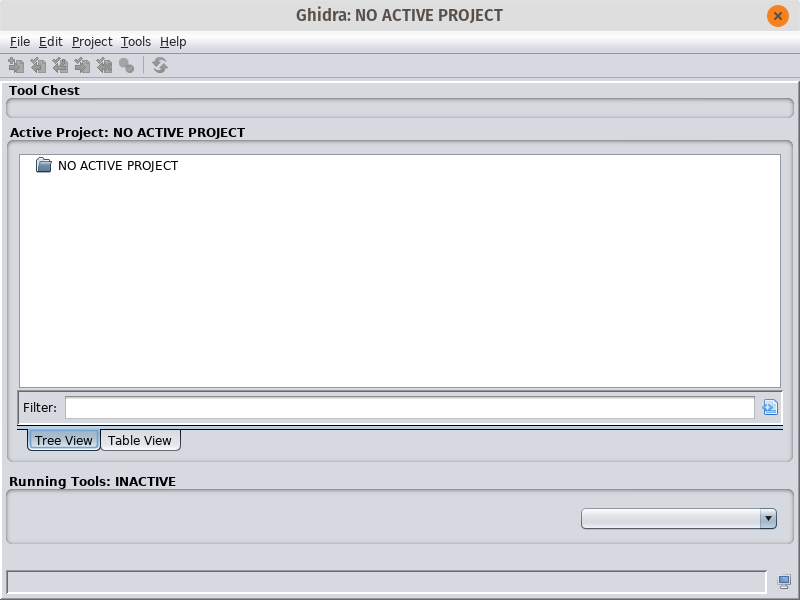

Create a new project File -> New Prooject -> Non-Shared Project. Fill in the details like your project name, where you're going to keep your files, etc.

### Change UI Look and Feel

One change that you can make right away is to change the UI's view from the default Java Swing style, to follow your system configuration. In the project view, open Edit -> Tool Options. Select the "Tool" section, and change the "Swing Look and Feel" to whatever you like. I chose GTK+. Restart Ghidra and you should be back in action.

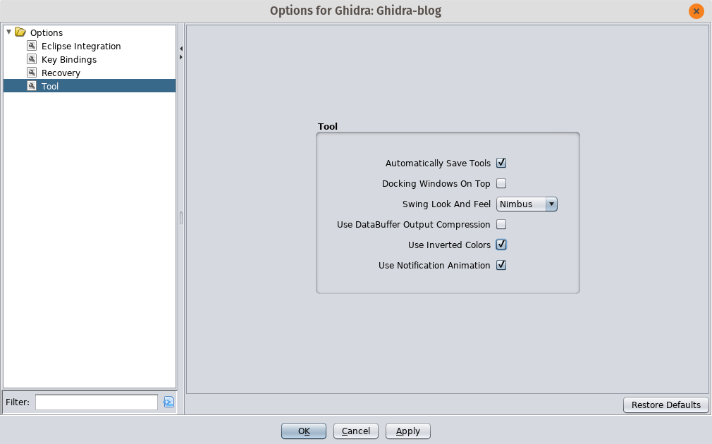

If you selected GTK+, you should see something like this:

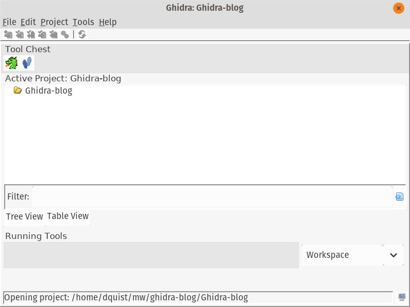

### Importing your first file

Next, you'll want to actually import an executable to start reverse engineering. File->Import File will add the file for analysis. For this blog I'll be using an extracted payload from the Gootkit malware series. You'll need to deobfuscate a sample, decrypt the payload, etc.

On the following screen accept the defaults and you will see a screen with summary information:

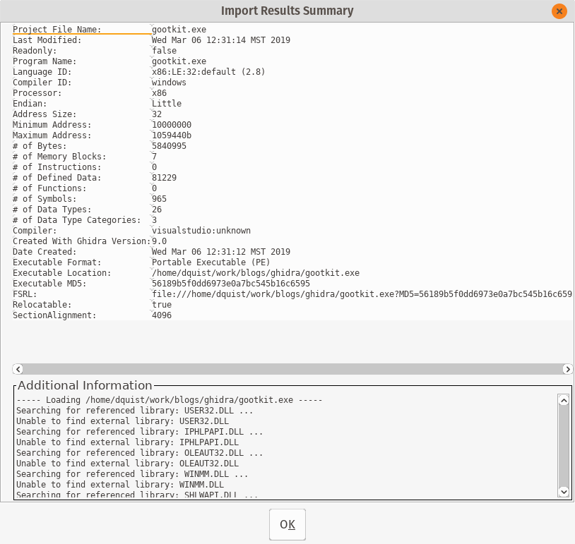

Now that you've imported the file, you need to actually look at it. Double-click on your file in the project overview, or highlight the file and click the Ghidra logo. .

Next, Ghidra will ask you whether you want to analyze the file. The answer is yes, yes I do want to analyze the file. You should too, so click Yes with the force of a thousand suns.

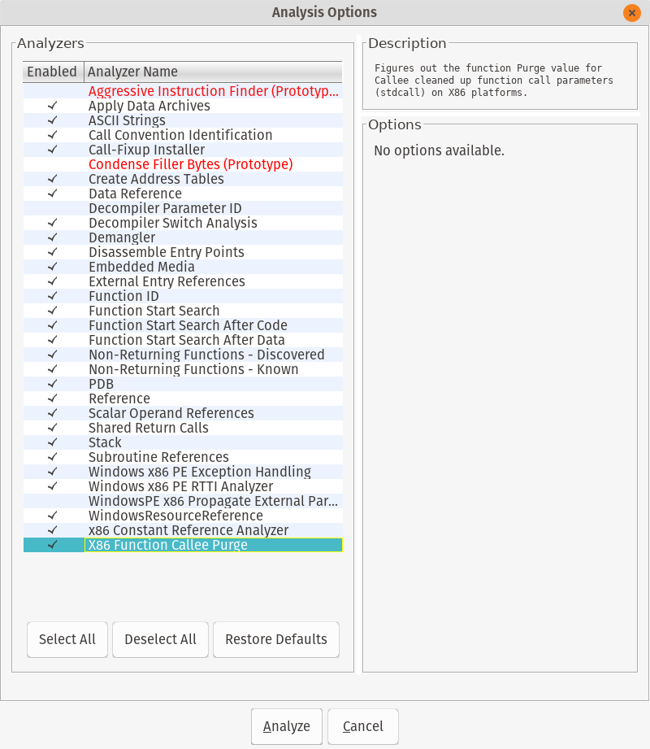

Accept the default analysis options and go get some coffee while Ghidra makes analysis romance with your file. This will take awhile. Tell your boss you're leveraging nation state reverse engineering tools for synergistic resonance.

You may see a dialog with warnings and errors. In my sample, Ghidra told me that without the PDB file it would be somewhat diminished in its analysis capability. I really get the feeling that malware is not the only executable use case for this tool.

### CodeBrowser Overview

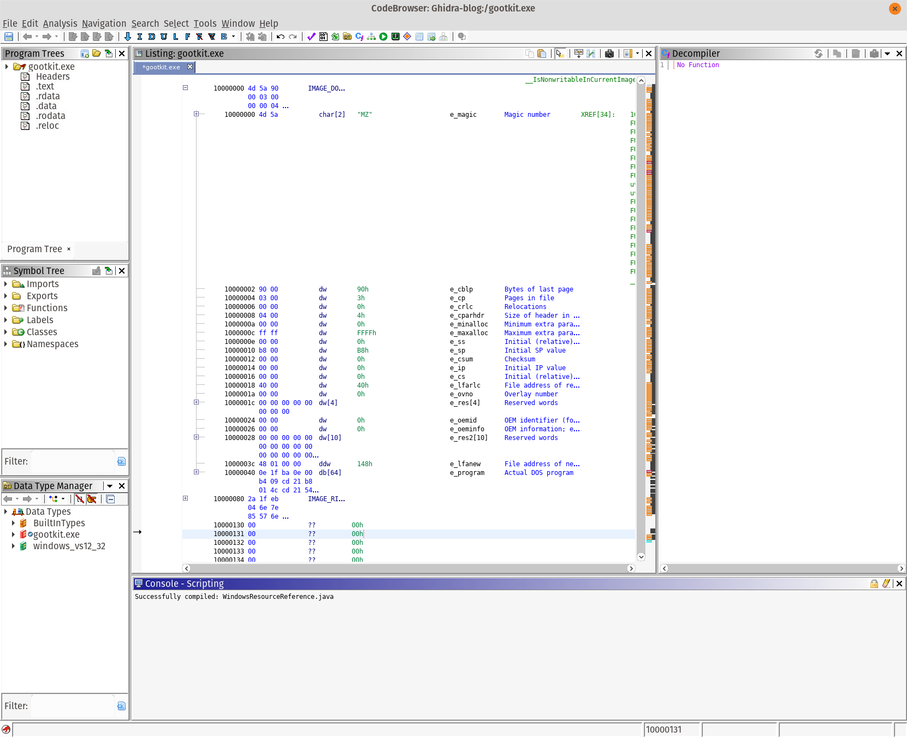

There are several important parts of the user interface. The program tree highlights the sections of the file, as well as the executable you are currently looking at. The symbol tree contains all the variables and information that Ghidra found during its analysis. The Data Type manager is one of the best features, and is extremely helpful for full source code reversing. It's also useful when dealing with some gnarly data structures.

The Listing is where we see the common disassembly view. Since I'm looking at a 32-bit Windows PE, relevant information is highlighted in the center view. What I really like is that all of the data structures are outlined in the code view. This makes understanding some internal Windows APIs very simple.

On the right is the decompiler, which we'll get into shortly.

### Second Round of UI Changes

Fonts are really small, especially on my High DPI display. There are a couple of places I needed to change the font size. I also changed the fonts to be more readable (to me).

First, we need to change the font size of the disassembly view. I prefer the Liberation Mono font, as it renders fairly well and is still readable. The configuration can be found in Edit -> Tool Options. I changed the font in the following sections:

1. ByteViewer - Changed to Liberation Mono size 16
2. Console - Liberation Mono size 16
3. Decompiler -> Display - Scroll down and find the font, set it to your liking
4. Listing Display -> Liberation Mono 16

After all the changes, my view looks like this:

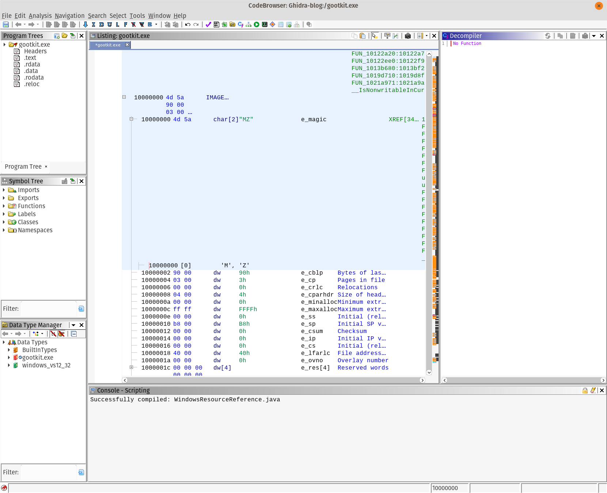

# Reverse Engineering Workflows

There are a variety of tasks where Ghidra can help you. If you look at the starting CodeBrowser listing, you'll see the common fields for PE files highlighted and called out. From my limited usage of Ghidra, this has been a huge time-saver.

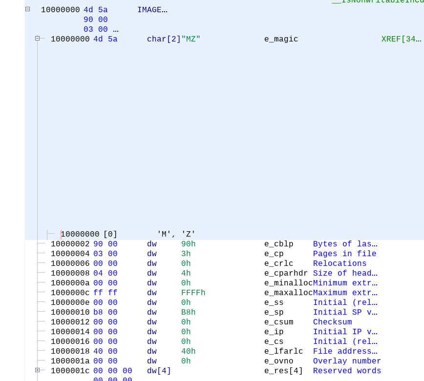

## Strings: The Reverse Engineer's Crutch

Strings are important to reverse engineering, and a large portion of my time when analyzing malware samples is decoding and deobfuscating strings. Ghidra makes this much easier, and in many cases translates them for you. At current count, there are about 3 places to get the string list.

The first way is to use Window -> Defined Strings. Ghidra is intelligent about how it finds strings, avoiding invalid strings that plague other tools. The second and third way to extract things are left as an exercise for the reader.

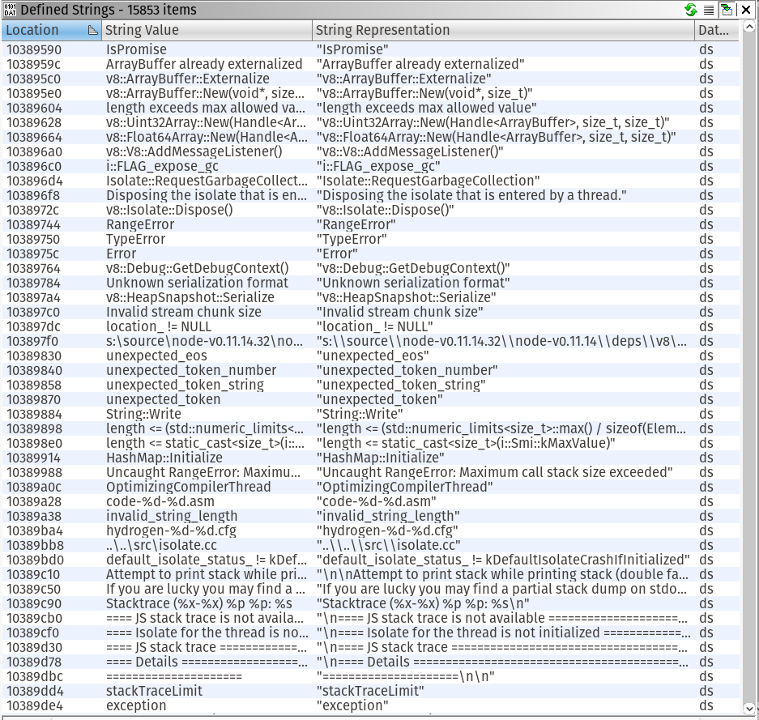

Gootkit packages an old version of NodeJS and associated javascript files to implement their implant. If you would like to see a full list of all the javascript files, search on Github.

Filtering can be done in the bottom of the strings string by simply typing what you're looking for. For gootkit, type `gootkit` and you should see something similar:

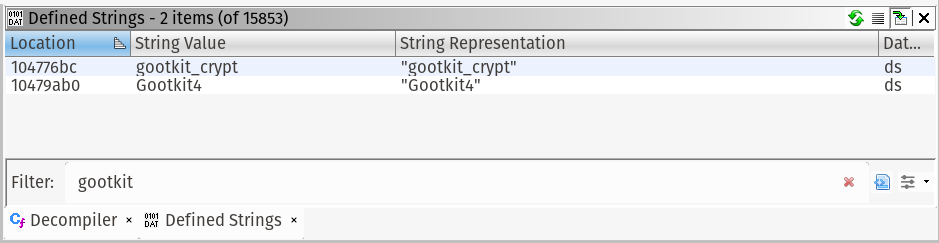

Double click a string, I chose `Gootkit4`. The disassembly listing will navigate to the code reference.

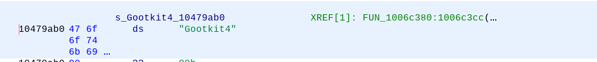

In green, you can see the cross references, or the places in the code where the string is available. Double-click on "FUN_1006c380" to be taken to the code where the string is used.

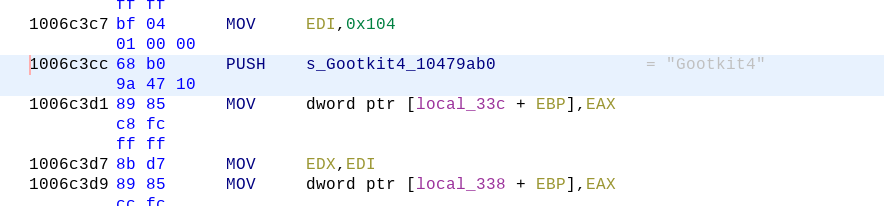

## Decompiler

Ghidra brings commercial quality decompilation to the masses, at the compelling price of absolutely free. As you navigate in the code view, the decompiler will automatically update with its interpretation of the assembly. In practice, I have found decompilers to be a good approximation of the C/C++ source code recovery. You still have to mess around with types, and actually making it compilable but it's very good.

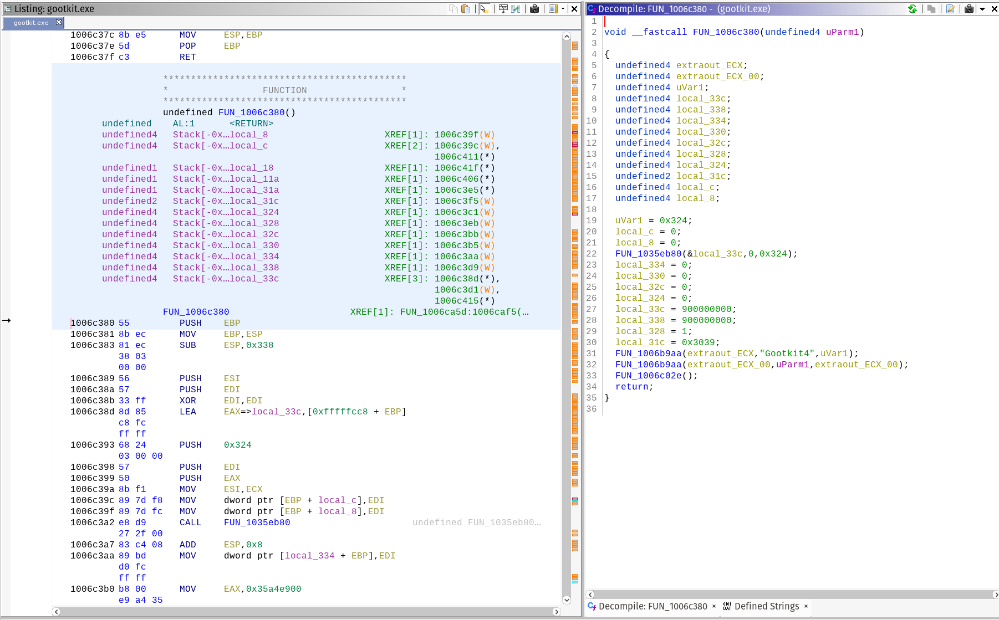

Thank you NSA! I take back some of the mean things I said about you.

## Imports

Finding the APIs that a malware sample uses greatly aids analysis. Ghidra has some stellar import functionality. One of the great features of IDA Pro was that it would identify embedded code that compilers include in executables to make execution faster. Ghidra takes the code detection to the next level.

The Symbol Tree view has the listing of all the imports, exports, functions, classes (if detected) and namespaces for your sample. When using a public Windows API with known data structures (`WININET.DLL`, I'm looking at you).

Using the imports, in combination with the structure analysis and decompiler, you malware will open for you like a flower on a dewey spring day.


# Conclusion

There are a lot of features in Ghidra, such as code-diffing, were omitted from the document. Program analysis is really the sweet spot for Ghidra, and the API is very complete. I'm really looking forward to the awesome features and expansions in the future.

After a few hours I was able to have good success in adapting to the tool. I have been able to analyze my malware queue much faster than normal.

A heartfelt thank you to the Ghidra developers for shepherding the tool through the public release process. It can be onerous, and I'm sure it was a herculean effort to get out in the open.
